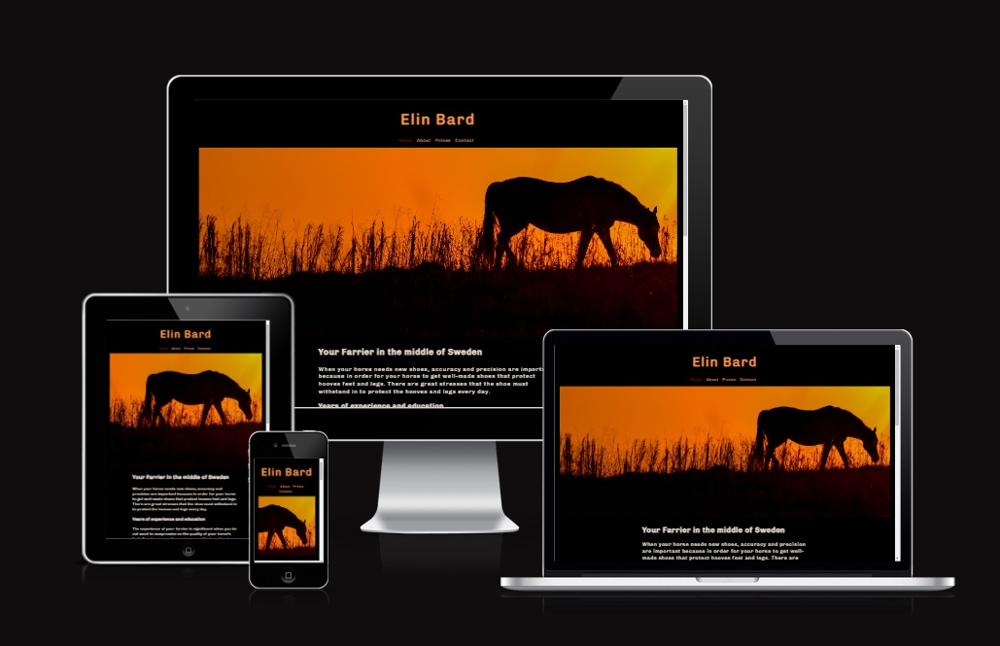
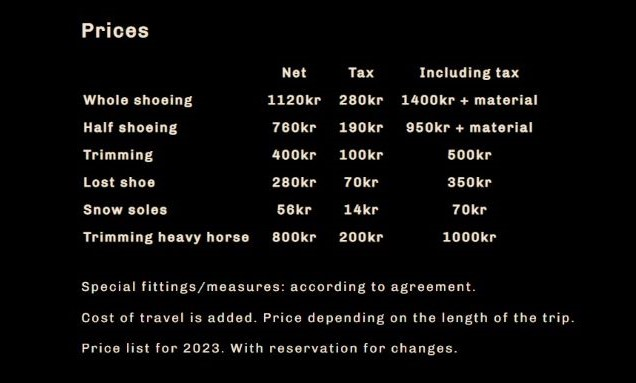

# **Elin Bard Farrier**

#### [View the live project here](https://linnsilver.github.io/Project1-Farrier/)

Elin Bard is a farrier whose catchment area is around Töreboda in the middle of Sweden. The website informs new and existing customers about Elin, which services she primarily provides, her education and experience. An important purpose of the website is that it should be easy to find contact details and prices.

## 

## UX User experience
The purpose of the webpage is primarily to make it easy for customers to make a contact. The navigation is as expected, easily accessed from the top of every page and links to social media are located at the bottom together with a phone number. The design of the page is peeled off, with warm and earth colors to make visitors feel welcome. The main orange, that is both in the hero image and in navigation, holds the design together.

## Features
### Top navigation
Centered just under the logo on all pages, the visitor will find the top navigation bar. The links change color to red when hovered over. The page that is currently displayed is marked with a red link so that the user can easily see which page they are currently on.
## 

### Price list
The price list is four columns with prices both with and without tax. Company customers want prices without taxes and private customers needs the price including tax. Price list for 2023. With reservation for changes.
## 

### Contact form
The contact form gives the user the opportunity to ask to be contacted. The user is asked to provide their name, phone number, email address and some additional information about their hours, when sending a message. The red star* tells the user that the information is required to fill in, to send the message. Sending the message will result in a new tab (at the moment the user is shown the formdump.codeinstitute.net page with the data they submitted displayed) showing the form result.
## 

### Footer
Contain an easy to find phone number and media links to Facebook and Instagram.  The external links will open in a new page, the aria-label inform of this. (At the moment, the media links will open the company start page.)
## 

### Features to implement later
Clicking the logo returns users to the home page.

## Technologies
- HTML
- CSS
- GitHub
- GitHub Pages
- Gitpod
- Google Fonts
- Font Awesome

## Testing
- HTML **W3C tools**
## 
[Home](assets/images/readme-images/html-check-home.jpg)
[About](assets/images/readme-images/html-check-about.jpg)
[Prices](assets/images/readme-images/html-check-prices.jpg)
[Contact](assets/images/readme-images/html-check-contakt.jpg)

- CSS **W3C tools** 
## 

- Lighthouse In DevTools
## 
### Browser Compatibility 
The following browsers have been tested:
 - Chrome Version 108.0.5359.125
 - Chrome Version 108.0.5359.125
 - Mozilla Firefox Version 108.0.1
 - Edge Version 108.0.1462.54
 - Opera Version 89.0.4447.91
 - Safari on macOS Version 16.1

 Tested on hardware:
 - Asus laptop 17 inch
 - MacBook Pro 16 inch
 - MacBook Pro 15 inch
 - Desktop: 2560 wide monitor to MacBook 

### Mobile responsiveness testing. 
Chrome Developer tools were used for more extensive testing.

Following mobiles has been tested:
 - iPhone 5 / SE
 - iPhone 7
 - iPhone Pro Max
 - Samsung Galaxy a52s
 - Huawei P20 pro
 - Sony Xperia 5 III

### Manual testing
#### Top menu
- Mouse hover over Home makes link go red. Tested on every page. Result -Pass.
- Mouse hover over About makes link go red. Tested on every page. Result -Pass.
- Mouse hover over Prices makes link go red. Tested on every page. Result -Pass.
- Mouse hover over Contact makes link go red. Tested on every page. Result -Pass.   

- Clicking Home navigates to home, and the menu link to home is red when on home. Result -Pass.
- Clicking About navigates to about, and the menu link to about is red when on about. Result -Pass.
- Clicking Prices navigates to prices, and the menu link to prices is red when on prices. Result -Pass.
- Clicking Contact navigates to contact, and the menu link to contact is red when on contact. Result -Pass.

#### Contact form
- Mouse hover over input field Name, makes a sign pop up to tell that input field must be filled out. Result -Pass.
- Mouse hover over input field Number, makes a sign pop up to tell that input field must be filled out. Result -Pass.
- Mouse hover over input field Email, makes a sign pop up to tell that input field must be filled out. Result -Pass.
- Mouse hover over text area Information, makes a sign pop up to tell that input field must be filled out. Result -Pass.  

- Attempting to submit the form without entering something in name results in a browser error message. Result -Pass.
- Attempting to submit the form without entering something in Number results in a browser error message. Result -Pass.
- Attempting to submit the form without entering an email that contain the appropriate tokens results in a browser error message. Result -Pass.
- Attempting to submit the form without entering something in, Information about your horse, results in a browser error message. Result -Pass.   

- Submitting the form with all the correct information provided sends the user to the Code Institute form dump, which displays data from all the fields. Result -Pass.
## 

#### Footer
- Mouse hover over Contact makes link go red. Tested on every page. Result -Pass.
- Clicking Contact navigates to contact. Tested on every page. Result -Pass.
- When on contact, mouse hover over Home makes link go red. Result -Pass.
- When on contact, Clicking Home navigates to Home. Result -Pass.

- Facebook link opens in new tab. (currently a placeholder for the real social media page) Tested on every page. Result -Pass.
- Instagram link opens in new tab. (currently a placeholder for the real social media page) Tested on every page. Result -Pass.
 
 #### Found and fix bugs: 
- Found that link in footer on Contact to Home was replaced with link to contact. Changed back to linking to home.
- Found that on alt img to hero img, width="100%" generated error in HTML validator changed to style="width:100%" solved problem.
- Found that text in contact form was displayed as disproportionately small in Safari on macOS. Added a CSS rule for the same font family and size in the form.

## Deployment
Create a [fork of the repository.](https://docs.github.com/en/get-started/quickstart/fork-a-repo#forking-a-repository)
1. Log in to GitHub and go to repository: LinnSilver/Project1-Farrier
2. Click button fork -Create a new fork.
3. Choose repository name.
4. Click create fork.

Now you have a fork of the repository in your repository. To access code:
 
5. In your new repository:
6. Click green button: Code arrow down.
7. Choose: Creat codespace on main - Code is opened in a web codespace.

Right now you do not have the files in the repository locally on your computer.
To save a copy locally on your computer:
 
9. On GitHub.com, navigate to your fork of the repository.
10. Above the list of files, click Code, Local.
11. Copy the URL for the repository.
12. Open Git Bash.
13. Change the current working directory to the location where you want the cloned directory.
14. Type  `git clone`, and then paste the URL you copied earlier.
15. Press Enter. Your local clone will be created.

It's important to commit and push correctly. Read more here:
- [How to Commit and push code from local file system to GitHub Pages.](https://docs.github.com/en/desktop/contributing-and-collaborating-using-github-desktop/making-changes-in-a-branch/committing-and-reviewing-changes-to-your-project)

After every change in the code, it's important to redo the test section. Go through:
- HTML W3C tools
- CSS W3C tools
- Lighthouse In DevTools
- Browser Compatibility
- Mobile Compatibility
- Manual testing

## Credits
### Content
All content on this webpage was written by the developer.

### Media
- Freeimages. All images were downloaded from [Freeimages.com](https://www.freeimages.com/photo/silhouette-of-a-horse-at-sunset-1640166)
- Google font -Font type Chivo is imported from Google font.
- Font awesome -Provided media link icons.
- Favicon -Favicon icon on tab was produced with Favicon.

### Acknowledgments
Thank you to my mentor Brian Macharia. For Your support and guidance. Your great knowledge and commitment during this project has made my project better and more enjoyable.
