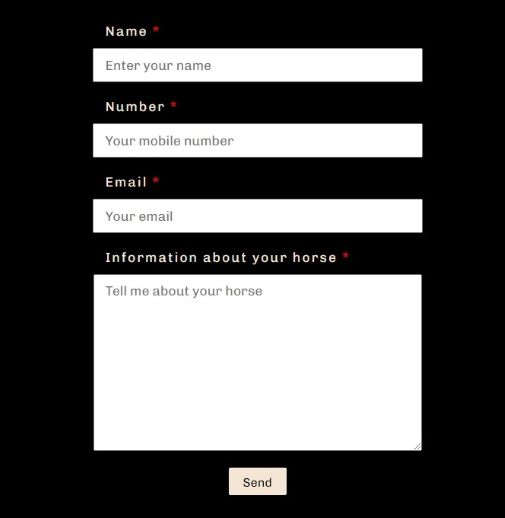

<!DOCTYPE html>
<html lang="en">

# **Elin Bard Farrier**

Elin Bard is a farrier whose catchment area is around Töreboda in the middle of Sweden. The website informs new and existing customers about Elin, which services she primarily provides, her education and experience. An important purpose of the website is that it should be easy to find contact details and prices.

#### [View the live project here](https://8000-linnsilver-project1farr-bhwvuwqk3sr.ws-eu80.gitpod.io/index.html)

## 

## UX User experience
The purpose of the webpage is primarily to make it easy for customers to make a contact. The navigation is as expected, easily accessed from the top of every page and links to social media are located at the bottom together with a phone number. The design of the page is peeled off, with warm and earth colors to make visitors feel welcome, the main orange, that is both in the hero image and in navigation, holds the design together.

## Features
#### Top navigation
Centered just under the logo on all pages, the visitor will find the top navigation bar. The links change color to red when hovered over. The page that is currently displayed is marked with a red link so that the user can easily see which page they are currently on.
## 

#### Price list
Holds a four column list with prices both with and without tax. Company customers want prices without taxes and private customers needs the price including tax. Price list for 2022. With reservation for changes.
## 

#### Contact form
With some additional information for the customer that if she/he likes, it's perfectly fine to send a text message on phone number.
## 

#### Footer
Contain an easy to find phone number and  media links to Facebook and Instagram.  The external links will open a new page, the aria-label inform of this.
## 

### Features to implement later
Clicking the logo returns users to the home page.

## Tecnologies
### Languages Used
-   HTML
-  CSS
## Testing
HTML **W3C tools**

CSS **W3C tools** 
## 
Lighthouse In DevTools
## 
### Browser Compatibility
-  Following browsers has been  tested  :
    - Chrome Version 
    - Mozilla Firefox Version 
    - Edge Version 
    - Opera
    - Safari on macOS
### Mobile Compatibility
 - iphone  5 / se
 - Samsung
 - Huawei
 

## Deployment

1.   [How to set up Github Pages](https://docs.github.com/en/pages/getting-started-with-github-pages/creating-a-github-pages-site)
    
2.  [How to Commit and push code from lokal file system to Github Pages.](https://docs.github.com/en/desktop/contributing-and-collaborating-using-github-desktop/making-changes-in-a-branch/pushing-changes-to-github)
    
3.  how one might clone and run it locally. An example of how someone’s written (2) and (3) before can be found [here](https://github.com/Code-Institute-Solutions/StudentExampleProjectGradeFive).

4. What to test after making changes.

## Credits?
### Content
 Allcontent was written by the developer.
### Media
All images were downloaded from [Freeimages.com](https://www.freeimages.com/photo/silhouette-of-a-horse-at-sunset-1640166)
-Google font -Font type.
-Fontawesome. -For media link icons.
-Favicon -For favicon icon on tab.
### Acknowledgments
Thanks to Brian and Love Silver.
