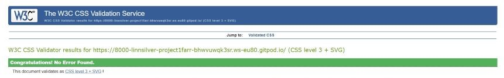
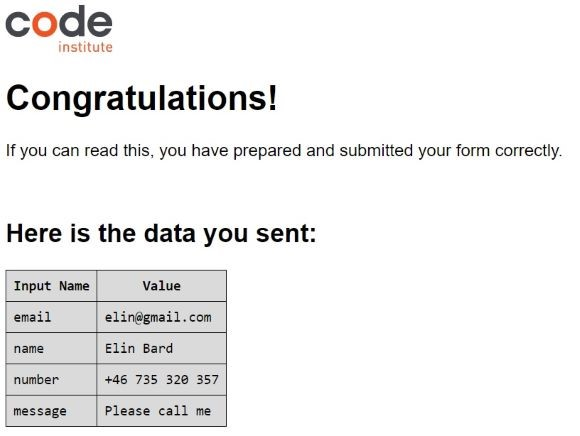

# **Elin Bard Farrier**

#### [View the live project here](https://8000-linnsilver-project1farr-bhwvuwqk3sr.ws-eu80.gitpod.io/index.html)

Elin Bard is a farrier whose catchment area is around Töreboda in the middle of Sweden. The website informs new and existing customers about Elin, which services she primarily provides, her education and experience. An important purpose of the website is that it should be easy to find contact details and prices.

## 

## UX User experience
The purpose of the webpage is primarily to make it easy for customers to make a contact. The navigation is as expected, easily accessed from the top of every page and links to social media are located at the bottom together with a phone number. The design of the page is peeled off, with warm and earth colors to make visitors feel welcome, the main orange, that is both in the hero image and in navigation, holds the design together.

## Features
### Top navigation
Centered just under the logo on all pages, the visitor will find the top navigation bar. The links change color to red when hovered over. The page that is currently displayed is marked with a red link so that the user can easily see which page they are currently on.
## 

### Price list
Holds a four column list with prices both with and without tax. Company customers want prices without taxes and private customers needs the price including tax. Price list for 2022. With reservation for changes.
## 

### Contact form
With some additional information for the customer that if she/he likes, it's perfectly fine to send a text message on phone number.
## 

### Footer
Contain an easy to find phone number and  media links to Facebook and Instagram.  The external links will open a new page, the aria-label inform of this.
## 

### Features to implement later
Clicking the logo returns users to the home page.

## Tecnologies
### Languages Used
- HTML
- CSS

## Testing
- HTML **W3C tools**
## 
[Home](assets/images/readme-images/html-check-home.jpg)
[About](assets/images/readme-images/html-check-about.jpg)
[Prices](assets/images/readme-images/html-check-prices.jpg)
[Contact](assets/images/readme-images/html-check-contakt.jpg)

- CSS **W3C tools** 
## 

- Lighthouse In DevTools
## 
### Browser Compatibility
-  Following browsers has been tested:
    - Chrome Version 108.0.5359.125 
    - Mozilla Firefox Version 108.0.1
    - Edge Version 108.0.1462.54
    - Opera Version 89.0.4447.91
    - Safari on macOS Version 16.1
### Mobile Compatibility
 - iphone  5 / se
 - Samsung
 - Huawei
 
### Manual testing
#### Top menu
- Mouse hover over Home makes link go red. Tested on every page. Result -Pass.
- Mouse hover over About makes link go red. Tested on every page. Result -Pass.
- Mouse hover over Prices makes link go red. Tested on every page. Result -Pass.
- Mouse hover over Contact makes link go red. Tested on every page. Result -Pass.
####
####
- Clicking Home navigates to home and menu link to home is red when on home. Result -Pass.
- Clicking About navigates to about and menu link to about is red when on about. Result -Pass.
- Clicking Prices navigates to prices and menu link to prices is red when on prices. Result -Pass.
- Clicking Contact navigates to contact and menu link to contact is red when on contact. Result -Pass.

#### Contact form
- Mouse hover over input field Name, makes a sign pop up to tell that input field must be filled out. Result -Pass.
- Mouse hover over input field Number, makes a sign pop up to tell that input field must be filled out. Result -Pass.
- Mouse hover over input field Email, makes a sign pop up to tell that input field must be filled out. Result -Pass.
- Mouse hover over text area Information, makes a sign pop up to tell that input field must be filled out. Result -Pass.
####
####
- Attempting to submit the form without entering something in name results in a browser error message. Result -Pass.
- Attempting to submit the form without entering something in Number results in a browser error message. Result -Pass.
- Attempting to submit the form without entering a email that contain the appropriate tokens results in a browser error message. Result -Pass.
- Attempting to submit the form without entering something in, Information about your horse, results in a browser error message. Result -Pass.

- Submitting the form with all the correct information provided sends the user to the Code Institute form dump, which displays data from all the fields. Result -Pass.
## 

#### Footer

- Mouse hover over Contact makes link go red. Tested on every page. Result -Pass.
- Clicking Contact navigates to contact. Tested on every page. Result -Pass.
- When on contact, mouse hover over Home makes link go red. Result -Pass.
- When on contact, Clicking Home navigates to Home. Result -Pass.

- Facebook link opens in new tab. (currently a placeholder for the real social media page) Tested on every page. Result -Pass.
- Instagram link opens in new tab. (currently a placeholder for the real social media page) Tested on every page. Result -Pass.
 

Found that link in footer on Contact to Home was replaced with link to contact. Changed back to linking to home.

Found that on alt img to hero img, width="100%" generated error in HTML validator changed to style="width:100%" solved problem.

## Deployment
Create a Github repository. [How to set up Github Pages](https://docs.github.com/en/pages/getting-started-with-github-pages/creating-a-github-pages-site)
- Choose:  …or import code from another repository.
- Paste: Repository clone address. Start importing.

To access code:
- In GitHub, select repository. 
- Click the green Gitpod button. 
- The code opens in gitpod.io

It's important to commit and push correctly. Read more here:
- [How to Commit and push code from lokal file system to Github Pages.](https://docs.github.com/en/desktop/contributing-and-collaborating-using-github-desktop/making-changes-in-a-branch/pushing-changes-to-github)

After every change in the code its important to redo the test section. Go through:
- HTML **W3C tools**
- CSS  **W3C tools**
- Lighthouse In DevTools
- Browser Compatibility
- Mobile Compatibility
- Manual testing

## Credits?
### Content
 All content was written by the developer.
### Media
- All images were downloaded from [Freeimages.com](https://www.freeimages.com/photo/silhouette-of-a-horse-at-sunset-1640166)
- Google font -Font type.
- Fontawesome. -For media link icons.
- Favicon -For favicon icon on tab.

### Acknowledgments
Thanks to Brian and Love Silver.
